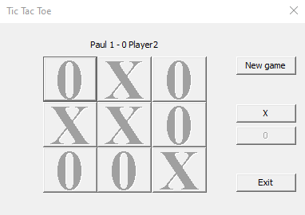

# Tic-Tac-Toe-Game-with-GUI-C/C++
2 Player Tic-Tac-Toe Game with GUI

I used windows.h for the interface.

First pop-up that appears when you start the game:

Adding a name

Clicking "OK" or "X"

Player1(Paul in this case) win

Pop-up that appears after win

After Player1's victory

Draw

Draw pop-up

After draw

Player2 win

Pop-up that appears after win

After Player2's victory

